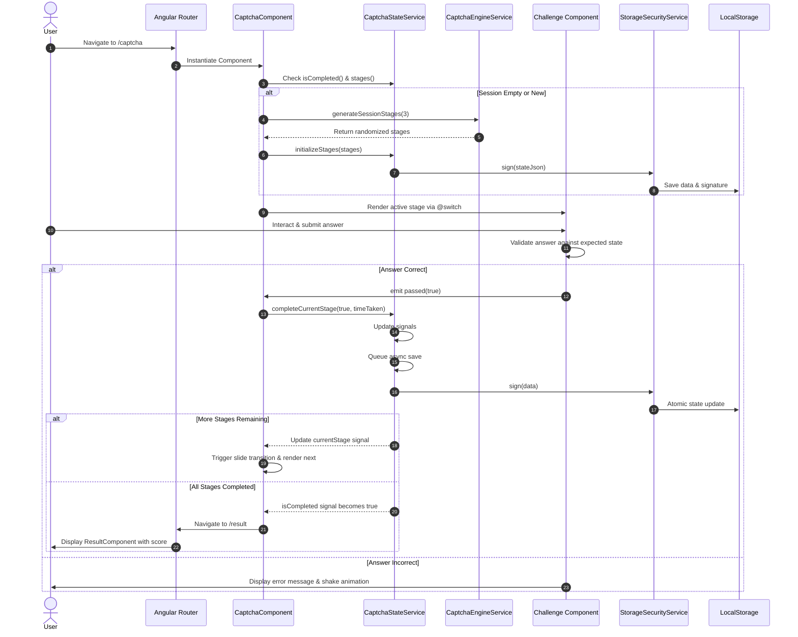
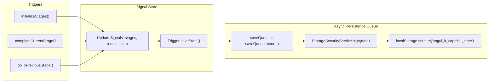

# AnguleIt - Modern Angular 18+ Captcha System

A high-performance, secure, signal-based multi-stage Captcha system built with **Angular 18+**. Designed with glassmorphic UI aesthetics, atomic state persistence, and zero race conditions.

---

## Technical Highlights

- **Angular 18+ Signals**: Reactive state management with `signal()` and `computed()` primitives.
- **Modern Control Flow**: Replaced legacy `*ngIf`/`*ngFor` with native `@if`, `@for`, and `@switch`.
- **Atomic Async Persistence Queue**: Sequential Promise queue preventing stale `localStorage` overwrites.
- **HMAC / SHA-256 Verification**: Signed state storage ensuring tamper-proof client-side verification.
- **Zero Security Bypasses**: Removed `DomSanitizer` security bypasses in favor of typed SVG templates.

---

## System Architecture

The diagram below illustrates the application structure, core service injections, and unidirectional signal data flow:

```mermaid
graph TD
    App["AppComponent"] --> RouterOutlet["Router Outlet"]
    RouterOutlet --> Home["HomeComponent"]
    RouterOutlet --> CaptchaComp["CaptchaComponent (Main Container)"]
    RouterOutlet --> Result["ResultComponent"]

    subgraph Core Services
        StateService["CaptchaStateService (Signal Store)"]
        EngineService["CaptchaEngineService (Stage Generator)"]
        SecurityService["StorageSecurityService (SHA-256 HMAC)"]
    end

    CaptchaComp -->|inject| StateService
    CaptchaComp -->|inject| EngineService
    Result -->|inject| StateService
    StateService -->|sign / verify| SecurityService

    subgraph Dynamic Challenge Components
        MathComp["MathChallengeComponent"]
        LogicComp["LogicChallengeComponent"]
        PatternComp["PatternChallengeComponent"]
        ImageComp["ImageChallengeComponent"]
    end

    CaptchaComp -->|@switch render| MathComp
    CaptchaComp -->|@switch render| LogicComp
    CaptchaComp -->|@switch render| PatternComp
    CaptchaComp -->|@switch render| ImageComp

    MathComp -->|passed output| CaptchaComp
    LogicComp -->|passed output| CaptchaComp
    PatternComp -->|passed output| CaptchaComp
    ImageComp -->|passed output| CaptchaComp
```

### Component Roles & Explanations

- **`CaptchaStateService`**: Central reactive signal store. Manages stage tracking, progress percentage calculation, completion scoring, and queued async `localStorage` saves.
- **`CaptchaEngineService`**: Session generator utilizing Fisher-Yates shuffling and cryptographic UUID generation for unbiased challenge order.
- **`StorageSecurityService`**: Provides SHA-256 HMAC signature creation and verification for persisted state strings.
- **`CaptchaComponent`**: Main challenge shell orchestrating dynamic stage rendering via `@switch`, slide transition animations, and step navigation.
- **`MathChallengeComponent`**: Evaluates random math equations (addition, subtraction, multiplication) using Reactive Forms and signal validation.
- **`LogicChallengeComponent`**: Evaluates number/shape sequence completion logic.
- **`PatternChallengeComponent`**: Visual odd-one-out shape selection rendered via clean inline SVGs.
- **`ImageChallengeComponent`**: Multi-select visual grid category identification component.
- **`ResultComponent`**: Displays final completion score, stage timings summary, and restart triggers.

---

## Application Workflow (Behind the Scenes)

This sequence diagram depicts the execution lifecycle from initialization to validation and completion:



---

## Race-Free Async Persistence Queue

To resolve stage skipping caused by asynchronous cryptographic operations overwriting each other, all state mutations enter a sequential promise queue:



---

## Getting Started

### Development Server

Run `ng serve` for a dev server. Navigate to `http://localhost:4200/`.

### Running Unit Tests

Run `ng test --watch=false` to execute unit tests via Karma.
All 39 unit tests execute with 100% pass rate.
